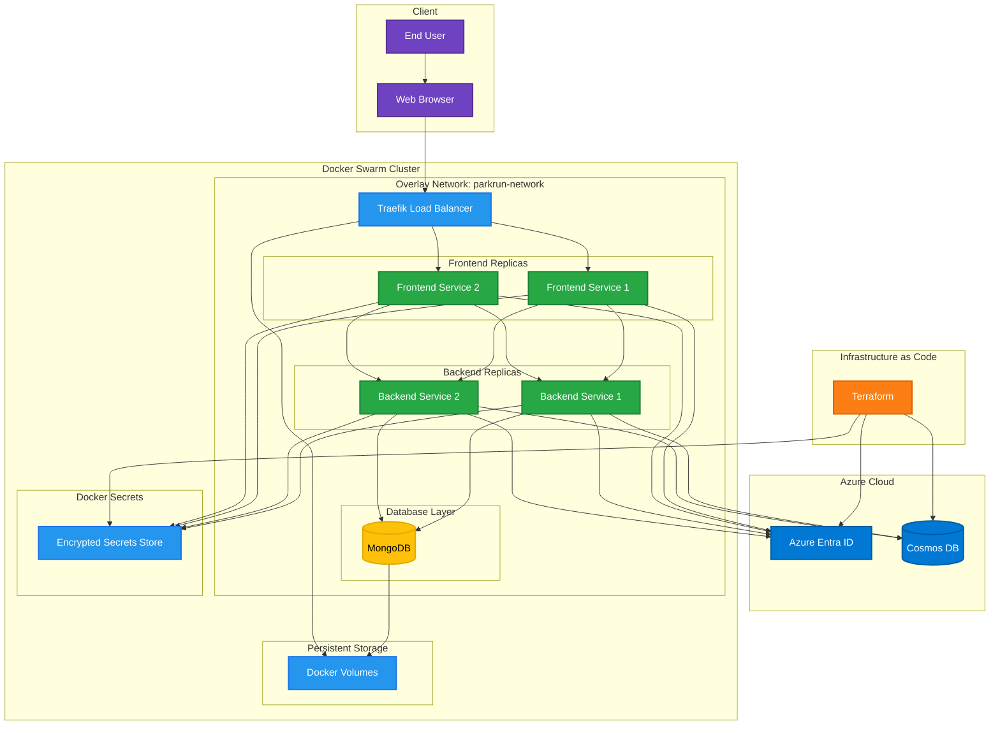
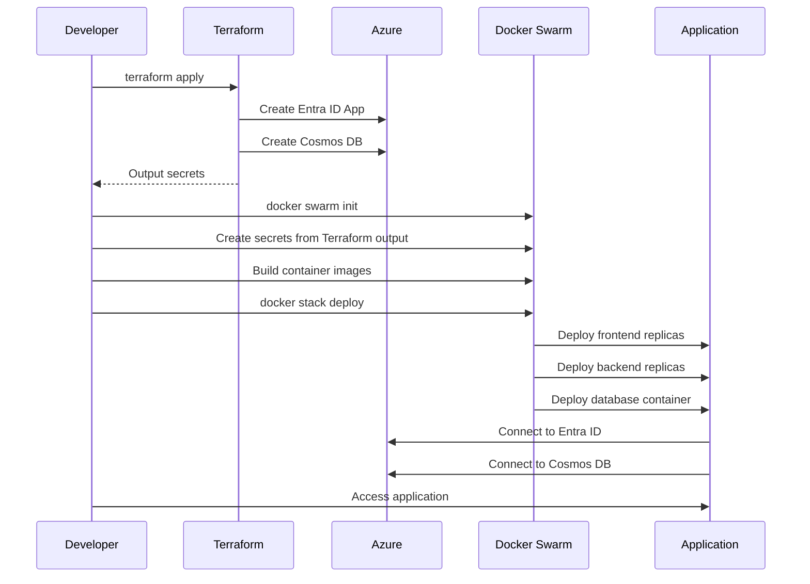

# Parkrun Helper Organizer - Architecture

## High-Level Architecture

## Component Details

### Frontend Layer
- **Technology**: React 18 + TypeScript
- **Authentication**: Microsoft MSAL for PKCE/OIDC flow
- **Container**: Nginx-served static files
- **Replicas**: 2 instances for high availability
- **Features**:
  - Protected routes with JWT validation
  - Responsive design with Parkrun branding
  - Helper management interface
  - Schedule management interface

### Backend API Layer
- **Technology**: NestJS + TypeScript
- **Authentication**: JWT validation against Azure Entra ID
- **Database**: Cosmos DB (primary) with MongoDB fallback
- **Container**: Node.js 20 Alpine
- **Replicas**: 2 instances for high availability
- **Features**:
  - RESTful API with OpenAPI documentation
  - Role-based access control
  - Automatic JWT token validation
  - Data persistence to NoSQL database

### Database Layer
- **Primary**: Azure Cosmos DB (managed service)
- **Fallback**: MongoDB (containerized)
- **Data Models**:
  - Helpers: volunteer information
  - Schedules: weekly volunteer assignments
- **Features**:
  - Automatic indexing
  - Data validation schemas
  - Backup and recovery

### Infrastructure Layer
- **Orchestration**: Docker Swarm
- **Load Balancer**: Traefik with automatic SSL
- **Secrets Management**: Docker Swarm Secrets
- **Networking**: Encrypted overlay network
- **Storage**: Persistent Docker volumes

### Azure Services
- **Azure Entra ID**: 
  - Application registration
  - OAuth 2.0/OpenID Connect provider
  - JWT token issuing and validation
- **Azure Cosmos DB**:
  - Globally distributed NoSQL database
  - Automatic scaling and backups
  - Multi-region replication

## Security Features

1. **Zero-Trust Architecture**
   - All components authenticate via Azure Entra ID
   - No hardcoded secrets in containers
   - Encrypted communication between services

2. **Secrets Management**
   - All sensitive data stored in Docker Swarm Secrets
   - Secrets mounted as files, not environment variables
   - Automatic secret rotation support

3. **Network Security**
   - Isolated overlay network
   - Container-to-container encryption
   - No direct database access from outside

4. **Authentication & Authorization**
   - PKCE flow for frontend (secure for SPAs)
   - JWT validation for all API calls
   - Role-based access control

## Deployment Flow

## Scaling Strategy

- **Horizontal Scaling**: Add more service replicas
- **Load Distribution**: Traefik distributes load automatically
- **Database Scaling**: Cosmos DB auto-scales based on usage
- **Geographic Distribution**: Deploy to multiple Docker Swarm clusters

## Monitoring & Observability

- **Health Checks**: Built into all containers
- **Service Discovery**: Automatic via Docker Swarm
- **Logging**: Centralized container logs
- **Metrics**: Traefik provides load balancer metrics